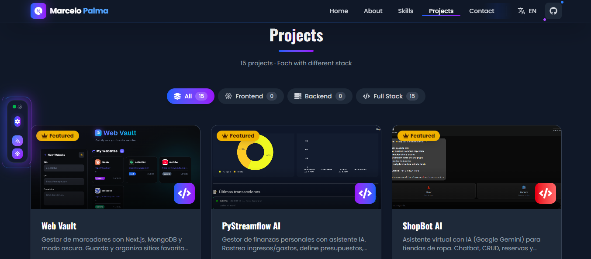
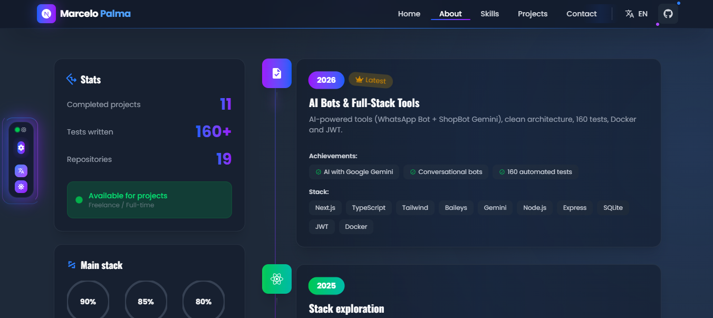
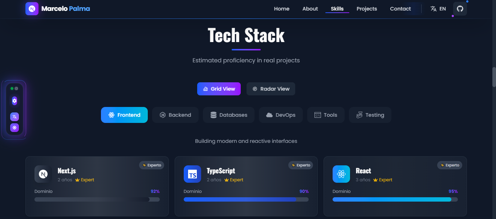
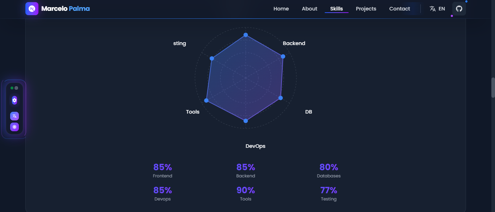
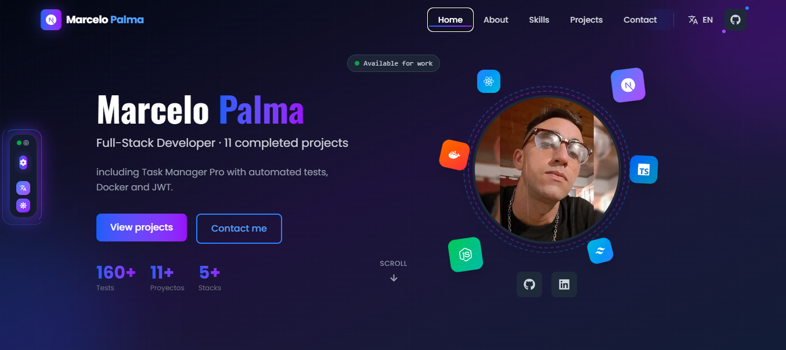

# Marcelo Palma - Professional Portfolio

<div align="center">

[](https://github.com/MarceloAdan73/marcelo-palma-portfolio/actions)
[](https://github.com/MarceloAdan73/marcelo-palma-portfolio/actions)
[](https://github.com/MarceloAdan73/marcelo-palma-portfolio)
[](https://github.com/MarceloAdan73/marcelo-palma-portfolio/actions)
[](https://marcelo-palma-portfolio.vercel.app)
[](https://www.sanity.io/)

---

**Full Stack Developer** | React & Next.js Specialist | Bahía Blanca, Argentina

*Building elegant digital experiences with modern web technologies.*

</div>

---

## 📌 About This Project

This is my **professional portfolio** – a showcase of my skills in modern web development. It's not just a website; it's a **fully-tested, accessible, and performant application** built with cutting-edge technologies.

### 🎯 What You'll Find Here
- **Live Portfolio**: Interactive showcase of my work
- **Sanity CMS Integration**: Dynamic content management for 14 projects
- **Well-Structured Code**: Clean architecture and best practices
- **Full Test Coverage**: Accessibility tests and integration tests
- **Responsive Design**: Beautiful on all devices
- **Dark Mode**: Seamless theme switching

---

## 📸 Portfolio Preview

<div align="center">

| | |
|:--:|:--:|
|  **Projects** |  **Detalles** |
|  **Habilidades** |  **Tech Stack** |
|  **Home** |  **Sanity CMS** |

</div>

---

## 🛠️ Tech Stack

| Category | Technology | Version |
|----------|-----------|---------|
| **Framework** | Next.js | 16.0.3 |
| **Language** | TypeScript | 5.x |
| **Styling** | TailwindCSS | 4.x |
| **Animations** | Framer Motion | 12.34.3 |
| **CMS** | Sanity | 5.25.1 |
| **Testing** | Jest + React Testing Library | Latest |
| **Quality** | ESLint | Latest |
| **Package Manager** | pnpm | 9.x |

---

## 📂 Project Structure

```
📦 marcelo-palma-portfolio
├── 📂 app/                          # Next.js App Router
│   ├── 📄 layout.tsx                # Root layout with providers
│   ├── 📄 page.tsx                  # Home page (Server Component)
│   └── 📄 globals.css               # Global styles
├── 📂 components/                   # React components
│   ├── 📄 Hero.tsx                  # Landing section
│   ├── 📄 Skills.tsx                # Skills showcase
│   ├── 📄 Projects.tsx              # Portfolio projects (Sanity-powered)
│   ├── 📄 FloatingControls.tsx      # Theme/Language switcher
│   └── 📂 __tests__/                # Component tests
├── 📂 context/                      # Global state
│   ├── 📄 AppContext.tsx            # App context (theme, language)
│   └── 📂 __tests__/                # Context tests
├── 📂 lib/                          # Utilities
│   └── 📄 sanity.client.ts          # Sanity API client
├── 📂 sanity/                       # Sanity CMS configuration
│   ├── 📄 sanity.cli.ts             # CLI configuration
│   ├── 📄 sanity.config.ts          # Studio configuration
│   └── 📂 schemas/                  # Content schemas
│       └── 📄 project.ts            # Project document schema
├── 📂 types/                        # TypeScript types
├── 📂 public/                       # Static assets
├── 📄 package.json                  # Dependencies
├── 📄 tsconfig.json                 # TypeScript config
├── 📄 jest.config.js                # Jest configuration
└── 📄 README.md                     # This file
```

---

## 🚀 Quick Start

### Prerequisites
- Node.js 18+ 
- pnpm 9+

### Installation

```bash
# Clone the repository
git clone https://github.com/MarceloAdan73/marcelo-palma-portfolio.git
cd marcelo-palma-portfolio

# Install dependencies
pnpm install

# Start development server
pnpm run dev
```

Open [http://localhost:3000](http://localhost:3000) in your browser.

### Sanity CMS (Optional)

To run the Sanity Studio locally:

```bash
# Navigate to sanity folder
cd sanity

# Install dependencies
pnpm install

# Start Sanity Studio
pnpm run dev
```

Open [http://localhost:3333](http://localhost:3333) to access the CMS dashboard.

### Available Scripts

```bash
# Development
pnpm run dev              # Start dev server

# Production
pnpm run build            # Build for production
pnpm run start            # Start production server

# Testing
pnpm test                 # Run tests
pnpm run test:watch      # Run tests in watch mode
pnpm run test:coverage   # Generate coverage report

# Code Quality
pnpm run lint            # Run ESLint
pnpm run lint:fix        # Fix ESLint issues
```

---

## 🧪 Testing & Quality

### Test Coverage
- ✅ **18 Tests**: Portfolio components
- ✅ **194+ Tests**: Across showcased projects
- ✅ **Global Context**: 100% coverage
- ✅ **Accessibility**: WCAG AA compliant
- ✅ **Integration Tests**: All major components tested
- ✅ **E2E Ready**: Set up for Cypress/Playwright

### Running Tests

```bash
# All tests
pnpm test

# Watch mode (development)
pnpm run test:watch

# Coverage report
pnpm run test:coverage

# Accessibility audit
pnpm test -- -t "accessibility"
```

---

## ♿ Accessibility

This portfolio is built with **accessibility first**:

✅ **Keyboard Navigation** - Fully navigable without a mouse  
✅ **Semantic HTML** - Proper use of semantic elements  
✅ **ARIA Labels** - Descriptive labels for screen readers  
✅ **Color Contrast** - WCAG AA compliant in light & dark mode  
✅ **Focus Management** - Clear focus indicators  
✅ **Tested** - jest-axe automated accessibility tests  

---

## 🎨 Features

### 🌙 Dark Mode
Seamless theme switching with persistent state using localStorage.

### 🎬 Smooth Animations
Framer Motion animations that enhance UX without overwhelming.

### 📱 Responsive Design
Mobile-first approach - looks great on all screen sizes.

### ⚡ Performance
- Optimized images
- Code splitting
- Server Components where possible
- Minimal JavaScript

### 🌍 i18n Ready
Context setup for multiple language support.

---

## 📝 Code Highlights

### TypeScript First
All components and utilities are fully typed for safety and better DX.

```typescript
// Example: Fully typed component
interface SkillProps {
  name: string;
  level: number;
  category: 'frontend' | 'backend' | 'tools';
}

const Skill: React.FC<SkillProps> = ({ name, level, category }) => {
  // Implementation
};
```

### Context API for State Management
Global state management without external dependencies.

```typescript
// App context with theme and language
const { theme, setTheme, language, setLanguage } = useAppContext();
```

---

## 📦 Sanity CMS Integration

This portfolio uses **Sanity** as a headless CMS to manage project content dynamically.

### Architecture

```
┌─────────────────┐       ┌─────────────────┐
│   Next.js App   │◄──────│   Sanity API    │
│  (localhost:3000)│  GROQ │  (sanity.io)    │
└─────────────────┘       └─────────────────┘
                                  ▲
                                  │
                          ┌─────────────────┐
                          │  Sanity Studio  │
                          │ (localhost:3333)│
                          └─────────────────┘
```

### Schema: Project

Each project document has the following fields:

| Field | Type | Description |
|-------|------|-------------|
| `title` | string | Project name (required) |
| `description` | text | Project description |
| `image` | image | Project screenshot with hotspot |
| `techStack` | array[string] | Technologies used |
| `liveUrl` | url | Live demo URL |
| `githubUrl` | url | GitHub repository URL |
| `featured` | boolean | Highlighted project flag |

### How It Works

1. **Content is fetched** from Sanity API using GROQ queries
2. **Server Component** (`app/page.tsx`) fetches projects at request time
3. **Error handling** gracefully falls back to empty array if fetch fails
4. **Projects component** renders the dynamic content with filters and animations

### Adding New Projects

1. Open Sanity Studio (`cd sanity && pnpm run dev`)
2. Go to **Projects** section
3. Click **Create new document**
4. Fill in the fields and publish
5. The portfolio automatically displays the new project

---

## 🚢 Deployment

This project is deployed on **Vercel** with automatic deployments from the main branch.

### Deploy Your Own

```bash
# Push to GitHub
git push origin main

# Vercel automatically deploys on push
# Or connect your repo at vercel.com
```

---

## 📊 Performance Metrics

- **Lighthouse Score**: 90+
- **Core Web Vitals**: All green
- **Bundle Size**: Optimized with code splitting
- **Performance**: <2s initial load

---

## 🤝 Contributing

While this is a personal portfolio, I appreciate feedback and suggestions!

### How to Contribute
1. Fork the repository
2. Create a feature branch (`git checkout -b feature/improvement`)
3. Make your changes
4. Write tests for new features
5. Submit a pull request

### Code Standards
- Follow the existing code style
- Write tests for new features
- Ensure all tests pass
- Update documentation as needed

---

## 📚 Learning Resources

This project implements best practices from:
- [Next.js Documentation](https://nextjs.org/docs)
- [React Documentation](https://react.dev)
- [TypeScript Handbook](https://www.typescriptlang.org/docs/)
- [Tailwind CSS](https://tailwindcss.com/docs)
- [Web Accessibility Guidelines](https://www.w3.org/WAI/WCAG21/quickref/)

---

## 📬 Get In Touch

Interested in collaborating? Let's connect!

<div align="center">

[](mailto:marcelo-palma@live.com)
[](https://www.linkedin.com/in/marcelo-palma-083b69352/)
[](https://github.com/MarceloAdan73)

**Available for**: Freelance projects • Full-time opportunities • Collaborations

📍 Bahía Blanca, Argentina

</div>

---

## 📄 License

This project is open source. Feel free to use it as inspiration for your own portfolio.

---

<div align="center">

**Built with ❤️ by [Marcelo Palma](https://github.com/MarceloAdan73)**

[⬆️ Back to Top](#marcelo-palma---professional-portfolio)

</div>